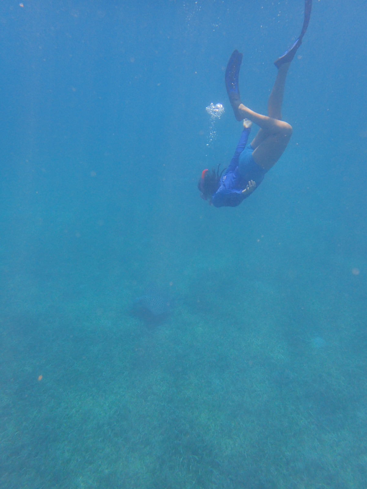

## Education

UNIVERSITY OF PUERTO RICO, MAYAGÜEZ CAMPUS (Mayagüez, PR) AUGUST 2022-
PRESENT

Faculty of Natural Sciences, Marine Science Master's degree

UNIVERSITY OF PUERTO RICO, RIO PIEDRAS CAMPUS (San Juan, PR) AUGUST
2016- MAY 2022

Faculty of Natural Sciences, Chemistry Bachelor's degree GPA: 3.748

## Current work

I am currently assisting on a water quality project for EcoEléctrica's
power plant, monitoring the company's seawater outflow at Guayanilla
Bay.

## Research project

My master's thesis consists of investigating seawater chemistry vertical
variability throughout the island of Puerto Rico. I am part of the
Biochemistry and Ecology Research Group (BERG), located on Isla
Magueyes, La Parguera. Learn more about our team's current projects and
potential opportunities [here](https://theberglab.com/).

```{r, out.width="50%", echo=FALSE}

```
